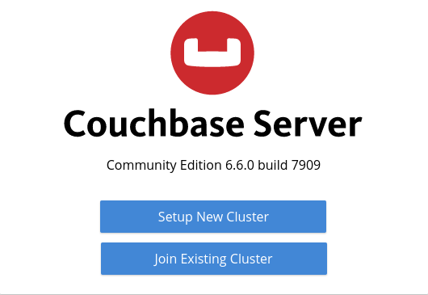
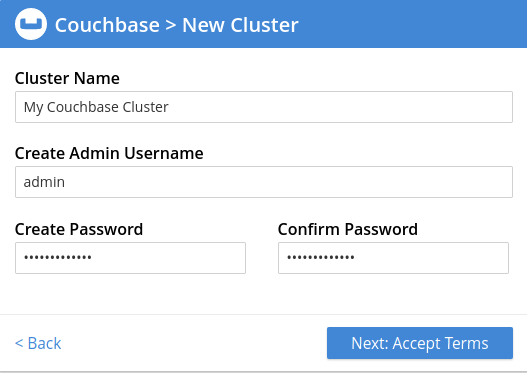
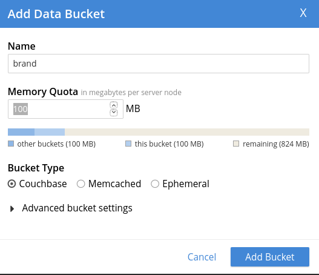
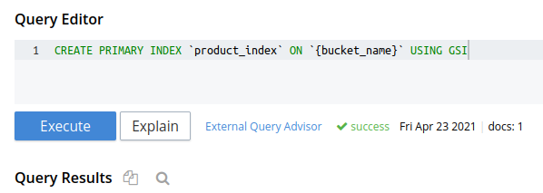

# Product catalog
This is a web-service for storing data about products with REST API.

### Project setup
For setup project this commands must be executed
```shell
$ cp .envs.example .envs
$ make up
```
>If you need custom settings, don't forget to change your `.envs` file.

When this command is finished, the database should be configured. Go to __http://127.0.0.1:8091__,
there you will see the page like on the picture below. You'll need to click on __Setup New Cluster__
button.



On the next page you'll need to enter the login and password to your cluster. They must be as same
as in `.envs` file.



The third thing you'll need to do is setting up the buckets. First you must create the next list of
buckets: __product__, __brand__, __tag__, __attribute__. All the buckets are being created the same
way, like on the picture below.



The last required setup thing to do is creating indexes for the buckets. For this you must execute
N1QL query like on the image below.



The text of the command must look this way:

```couchbasequery
CREATE PRIMARY INDEX `bucket_index` ON `bucket` USING GSI
```
The word _bucket_ needs to be replaced with the actual bucket name. This operation must be
executed for all the buckets in the project.

Now the application is ready to accept connections, it needs to be restarted.
```shell
$ make down
$ make up
```

### Testing
For running tests you need to execute this:
```shell
$ make test
```